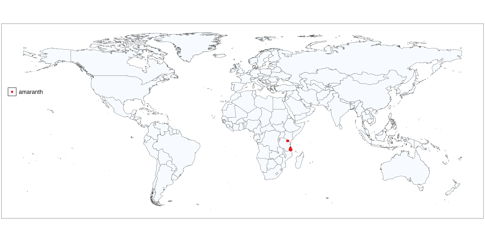

<!-- badges: start -->
[](https://creativecommons.org/licenses/by-sa/4.0/legalcode.en) 
<!-- badges: end --> 

# Global multi-crop agricultural trial data supported by citizen science

The triadic comparison of technologies (tricot) is a citizen science approach for testing technology options in their target environments, which has been applied to on-farm testing of crop varieties. ‘Triadic’ refers to the sets of three technology options that are compared by each participant. In the approach, participants are invited to test a anonymous set of three technologies (out of a larger number, generally between 5 to 20) randomly assigned. […] Between 2011 and 2025 the tricot approach was applied in XX countries in Central America, Sub-Saharan Africa and Asia with YY crops.

---

## Crops and sites currently covered by the dataset

The map below shows the crops and trial sites that are currently available for public use. Each point represents a trial location, and the legend indicates the crop(s) associated with those sites. This visualization helps to quickly identify the regions and crops that are currently represented in the dataset.  The dataset is shared under the [CC BY-SA 4.0 license](https://creativecommons.org/licenses/by-sa/4.0/legalcode.en), which allows others to use, share, and adapt the material, provided appropriate credit is given and any derivative works are distributed under the same license.




## Data structure

``` text
├── Tricot data 
│   ├── metadata
│   │   ├── changelog
│   │   │   ├── version
│   │   │   ├── notes
│   │   |   ├── software
│   │   │   │   ├── package
│   │   │   │   ├── package version
│   │   ├── doi
│   │   ├── license
│   │   ├── trial id
│   │   ├── trial name
│   │   ├── trial type
│   │   ├── trial experimental site
│   │   ├── trial unit of analysis
│   │   ├── trial objective
│   │   ├── trial description
│   │   ├── trial country (ISO2)
│   │   ├── date
│   │   │   ├── date start (YYYY-MM-DD)
│   │   │   ├── date end (YYYY-MM-DD)
│   │   ├── bounding box
│   │   │   ├── xmin (0.00)
│   │   │   ├── xmax (0.00)
│   │   │   ├── ymin (0.00)
│   │   │   ├── ymax (0.00)
│   │   ├── data producer name
│   │   ├── data producer email
│   │   ├── data producer institute
│   │   ├── program (ADCIN, RTB, BOLDER)
│   │   ├── crop name
│   │   ├── taxon
│   │   ├── N participants
│   │   ├── N men
│   │   ├── N women
│   │   ├── genotypes
│   │   │   ├── genotype name
│   │   │   ├── role in trial
│   │   │   ├── year release
│   │   │   ├── market segment
│   │   │   ├── country of origin
│   │   │   ├── remarks
│   │   ├── variables
│   │   │   ├── variable name
│   │   │   ├── description
│   │   │   ├── ontology id
│   │   │   ├── value type
│   │   │   ├── unit
│   │   │   ├── controlled vocabulary
│   ├── block data
│   │   ├── block id
│   │   ├── longitude
│   │   ├── latitude
│   │   ├── planting date
│   │   ├── gender
│   │   ├── age
│   │   ├── ...
│   │   ├── any other data
│   ├── plot data
│   │   ├── block id
│   │   ├── genotype name
│   │   ├── trait
│   │   ├── collection moment 
│   │   ├── value
│   │   ├── value type (rank, numeric, text, date)
│   ├── rank analysis
│   │   ├── collection moment
│   │   ├── trait
│   │   ├── genotype name
│   │   ├── estimate
│   │   ├── se
│   │   ├── casi se
│   │   ├── casi var
```


---

