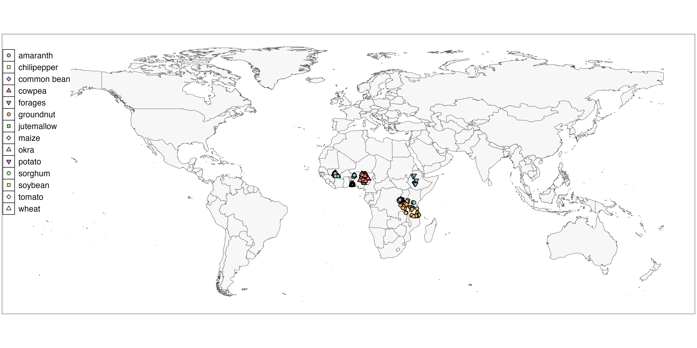

According to \citep{deSousa2024} and \citep{vanEtten2019}


```{r map, fig.pos = "H", echo = FALSE, message = FALSE, dpi=300, out.width = '100%', fig.cap=paste0("Geographical distribution of crops and trial sites that are currently available for public use. Each point represents a trial location, and the legend indicates the crop(s) associated with those sites. Administrative boundaries are based on the Database of Global Administrative Areas (GADM). The authors remain neutral with regard to jurisdictional claims in maps.")}

```


# Acknowledgments

This work has been supported by the projects 1000FARMS (INV-031561) funded by the Gates Foundation, and BOLD Work Package 7 (Crop Trust Ref: CONT-1522) funded by the Norwegian Agency for Development Cooperation (Norad) through The Global Crop Diversity Trust.

# References

::: {#refs}
:::


